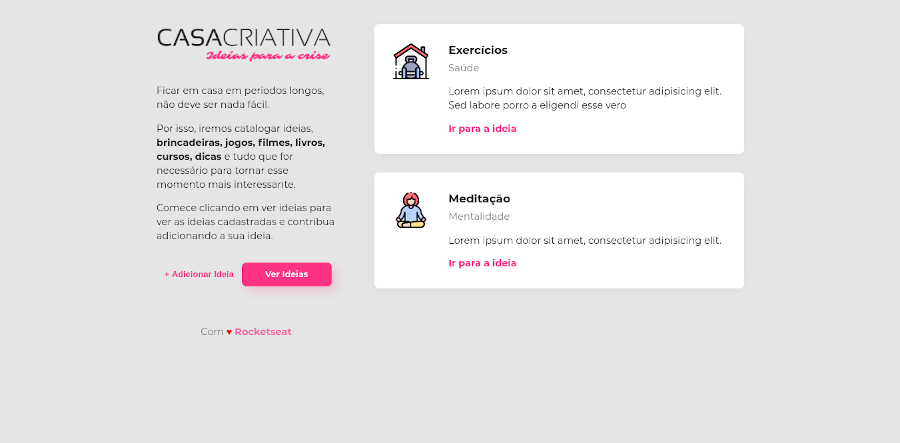

<h1 align="center">
  
</h1>

<h3>
  Front-end
</h3>

<ul>
  <li>  <strong> HTML5 </strong> </li>
  <li>  <strong> CSS3 </strong> </li>
  <li>  <strong> JavaScript </strong> </li>
</ul>

<h3>
  Back-end
</h3>

<ul>
  <li>  <strong> Node.js </strong> </li>
  <li>  <strong> SQLite 3 </strong> </li>
</ul>

<h3>
  Dependências
</h3>

<ul>
  <li> <strong> Express </strong> </li>
  <li> <strong> Nodemon </strong> </li>
  <li> <strong> Nunjucks </strong> </li>
  <li> <strong> Sqlite3 </strong> </li>
</ul>

### Telas

## Licença
[MIT](LICENSE)

